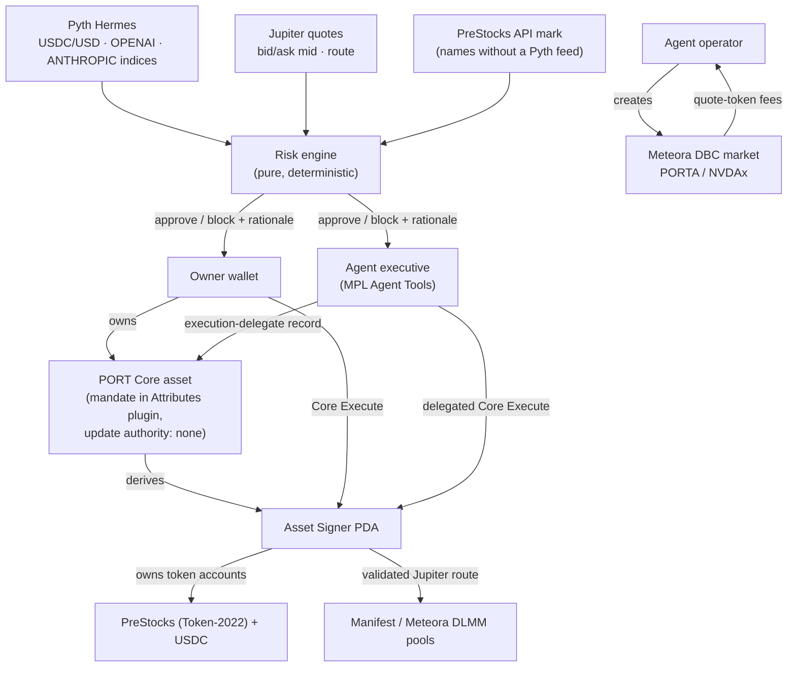

# PORT: an investment account you can own

**PORT is a Metaplex Core asset whose deterministic Asset Signer holds a portfolio of pre-IPO PreStocks. Every trade is signed through Core Execute, a bounded agent can run it under revocable delegation, and selling the account is one Core transfer: the stocks never move, only the ownership does.**

> **Demo video:** [`docs/demo/port-demo.mp4`](docs/demo/port-demo.mp4) (2:33, recorded by driving the real UI on the mainnet fork; waits for live quotes and confirmations are fast-forwarded 8×) · Evidence: [`docs/evidence/`](docs/evidence)

---

## Problem

A brokerage account bundles custody, positions, automation, identity and history, and the broker owns all of it. You can't hand the account to someone else, you can't give a bot narrowly scoped trading rights that the protocol enforces, and you can't sell the account as a single object.

## Solution

PORT turns the account itself into an ownable Solana object:

| Property | How PORT implements it |
| --- | --- |
| **Custody** | Positions sit in token accounts owned by the Core asset's **Asset Signer** PDA (`["mpl-core-execute", asset]`). No wallet holds them. |
| **Control** | Only **Core Execute** can move them. Core authorizes the current **owner**, or an **MPL Agent executive** holding an execution-delegate record. Anyone else is rejected on-chain. |
| **Mandate** | Target weights and risk limits are stored on the asset in an **owner-managed Attributes plugin**. The mandate travels with the account, and only the current owner can change it. |
| **Automation** | A deterministic agent plans the smallest rebalance back within tolerance. It executes only trades that pass every Pyth-backed policy check, signing as a registered executive through delegated Execute. |
| **Transfer** | One Core `transfer` hands over every position, the mandate, the agent registration and the history. The Asset Signer address and all balances stay the same. |
| **No lingering creator control** | Update authority is **renounced** at creation. After a sale, the original creator can't edit the asset. |

### Why this needs Solana and Core Execute

Core Execute gives every Core asset a program-derived signer that only the asset's owner (or its registered delegate) can drive. That's what makes an ownable, transferable account possible without writing a custom custody program. PORT deploys **no bespoke on-chain program**: custody, authorization and delegation are Metaplex Core and MPL Agent Tools; trading is Jupiter into the live PreStocks pools.

## Architecture



```text
packages/
  shared/        Types, zod schemas, fixed-point helpers, disclaimer
  risk-engine/   Valuation, drift, bounded rebalance planner, every policy check (pure)
  port-sdk/      createPort, fetchPort, balances, deposit, guarded Core Execute, delegation, transfer
  integrations/  Jupiter (validated routes), PreStocks, Pyth, pricing, agent orchestration,
                 Meteora DBC agent market, ClawPump client, activity store
apps/web/        Next.js dashboard + API routes (agent key stays server-side) — see apps/web/README.md
scripts/         localnet, mainnet-fork demo environment, bootstrap, verify, agent market
```

## Security model: owner, Asset Signer, delegate

| Identity | Colour in the UI | Can | Cannot |
| --- | --- | --- | --- |
| **Core owner** | vermilion ◆ | Execute any allowlisted instruction as the Asset Signer; delegate/revoke; edit the mandate; transfer the PORT | — |
| **Asset Signer** | verdigris ⬢ | Hold every position; sign only by CPI from Core Execute | Sign on its own; move on transfer |
| **Agent executive** | ochre ✦ | Execute through the delegate record, and only trades the policy approved (enforced by the agent) | Transfer the PORT, change the mandate, delegate, or act after revocation (enforced on-chain) |
| **Connected wallet** | ink ◉ | Whatever its role above allows; owner actions are disabled in the UI when it isn't the owner | — |

Proven on-chain against the real programs (`packages/port-sdk/test/lifecycle.int.test.ts`, 8 tests):
- A stranger's Execute is rejected by Core (`0x1a`), and so is an old owner's after a transfer. The new owner's Execute succeeds.
- A delegate can Execute only when it presents its record, and can't after revocation.
- **Delegations persist across a Core transfer.** Records don't store who granted them, so a new owner inherits every live delegate. The dashboard shows an "inherited execution delegate" warning with a one-click revoke, and the transfer screen says so before you sign.

Client-side guards on every Execute (`port-sdk/src/execute.ts`, `integrations/src/jupiter.ts`):
- **Program allowlist:** SPL Token, Token-2022, Associated Token, System, Jupiter v6.
- **Signers:** the Asset Signer is the only inner signer.
- **Jupiter output is untrusted:** only the `route` variant is accepted. Authority, source, destination, output mint, `in_amount`, `quoted_out_amount`, slippage and platform fee are all decoded from the instruction bytes and checked against the risk-approved plan. 11 adversarial tests cover this.
- **Keys:** the agent's key never leaves the server. Browser demo wallets are generated and stored only in the browser. `.keys/` is gitignored.
- **Activity log:** a browser-reported action is recorded only after the server confirms the transaction succeeded, was signed by the claimed actor, and touched the PORT.

## Risk policy (Pyth-gated, fail-closed)

Every check always runs, so each decision comes with a complete explanation. A trade executes only when **all** of them pass.

| Check | Default (Fund #001) |
| --- | --- |
| `PRICE_FRESH`: token and cash price age | ≤ 90 s |
| `PRICE_CONFIDENCE`: Pyth confidence / Jupiter half-spread | ≤ 250 bps |
| `REFERENCE_SPREAD`: token vs reference (Pyth index or PreStocks mark), per-asset band | ≤ 25% (pre-IPO names trade at −22%…+17% to mark) |
| `REFERENCE_FRESH` / `REFERENCE_CONFIDENCE` | ≤ 90 s / ≤ 250 bps |
| `VOLATILITY`: price vs Pyth EMA | halve above 3%, reject above 6% |
| `MAX_TRADE_SIZE` | ≤ 30% of NAV |
| `DAILY_NOTIONAL`: rolling 24 h | ≤ 100% of NAV |
| `CASH_FLOOR` / `MAX_POSITION_WEIGHT` (post-trade) | ≥ 5% / ≤ 35% |
| `SLIPPAGE_LIMIT`: market slippage beyond known fees | ≤ 100 bps, enforced on-chain via min-out |
| `TRANSFER_FEE`: issuer Token-2022 fee | ≤ 150 bps (PreStocks: 100) |
| `QUOTE_VS_ORACLE`: worst-case fill vs oracle value | ≤ spread + slippage + fee |
| `MINT_ALLOWLIST` / `PROGRAM_ALLOWLIST` / `QUOTE_INPUT_MATCH` / `VALUATION_COMPLETE` | strict |

In thin books the agent halves a trade and re-quotes (up to three times) when market impact is the only failing check. That keeps it the smallest trade that still moves toward target. Integer fixed-point math throughout; 42 table-driven tests cover decimals, rounding, stale and future prices, spreads, volatility, cash floor, max weight, trade size, daily cap, slippage, fees and determinism.

## Sponsor integrations

| Track | Integration | Why it is essential | Status |
| --- | --- | --- | --- |
| **Main** | Portable Core-owned account | New on-chain ownership primitive: Asset Signer custody, Core Execute, MPL Agent delegation, transfer | ✅ Proven on real programs (localnet with devnet builds; mainnet fork) |
| **PreStocks** | OPENAI, ANTHROPIC, SPACEX, ANDURIL held and traded by the Asset Signer | The investable private-market portfolio | ✅ Real Jupiter → Manifest / Meteora DLMM routes into the live PreStocks pools, executed through Core Execute on a mainnet fork. **Not yet run on mainnet** (needs funds). |
| **Meteora** | NVDAx-quoted Dynamic Bonding Curve for the agent token (PORTA) | A market for the operator, priced in a tokenized stock; fees accrue in NVDAx | ✅ Real DBC program on a mainnet fork: config + pool + buy |
| **Clawpump** | Operator registration and a stock-paired token launch (pump.fun pair via `pumpQuoteMint`, e.g. NVDAx; 1–3% creator fee) | Tokenized autonomous operator | ⚠️ Client implemented from the official CLI and docs; the API key is verified (`/pump-pairs` lists 170 assets including NVDAx and SpaceX). **No launch executed:** it creates a public mainnet token and needs explicit approval. The Meteora leg is PORT's own DBC adapter. |
| Pyth (not a submitted track) | Execution risk gate | Prices directly permit or block trades | ✅ Live with an API key: Pyth USDC/USD gates every trade. The OpenAI/Anthropic index feeds need the gated `pyth-indices` entitlement; without it the reference falls back to the PreStocks mark, labeled "Pyth index not entitled". |

Notes on the choices:
- **xAI and Databricks are not issued by PreStocks.** SpaceX and Anduril take their slots. No Tessera or other pre-IPO tokens are used.
- **PreStocks can't be a DBC quote asset.** They carry a 1% Token-2022 transfer fee, which Meteora rejects. NVDAx carries a Meteora token badge and no fee, and fits an AI-private-markets operator.
- **The agent market design is data** (`integrations/src/meteora.ts → AGENT_MARKET_DESIGN`):
  - flat 1% fee collected in NVDAx, split 50/50 creator/partner after the protocol share;
  - 80% of supply sold on the curve;
  - graduates at 10 NVDAx (≈ $1.8k, above Meteora's ~$750 minimum for stock-quoted pools) into DAMM v2 with a 1% fee;
  - liquidity permanently locked;
  - immutable mint.

## What PreStocks actually look like on-chain (and how PORT handles it)

| Property (verified 2026-09-22) | Handling |
| --- | --- |
| Token-2022, 9 decimals | Token-2022-aware associated token accounts and transfers throughout |
| **1% transfer fee** (epoch-scheduled) | Read live from the mint. Fee and slippage compound: requested slippage = `1 − (1−fee)(1−slip)`. The risk engine sees net output. On the fork, fills matched the fee-adjusted quote exactly. |
| **Scaled UI amount** (OPENAI ×1.486, SPACEX ×5) | Prices converted to per-raw-token, with the multiplier read from the mint. Computed UI mids match PreStocks' own token prices. |
| Issuer pause + permanent delegate | Paused mints are refused; the disclosure explains the custody risk |

## Quickstart

Requirements: Node 22+, pnpm 10, and the Solana CLI (`solana-test-validator`).

```bash
git clone git@github.com:blockiosaurus/port.git && cd port
pnpm install
pnpm quickstart
```

That checks prerequisites, writes a `.env` if there isn't one, builds a fresh fork of Solana
mainnet on `:28899` (cloning ~640 accounts: Core, MPL Agent, Token-2022, Jupiter, the PreStocks
pools, Meteora DBC and NVDAx), launches the agent-token market, and serves the dashboard on
http://localhost:3100. Ctrl+C stops both. Then, in the browser: **Faucet → Create PORT → Deposit →
Trade → Delegate → Run agent → Transfer PORT → connect as Wallet B → trade → Revoke.**

`pnpm quickstart --reset` rebuilds the fork (do this before a live demo: repeated buys in the same
cloned pool eventually trip the on-chain minimum-out, which is the safety check working). Without a
`PYTH_API_KEY` it switches on clearly labelled fallback prices; with one, live Pyth USDC/USD gates
every trade. A private `MAINNET_RPC_URL` makes the fork build much faster than the public RPC.

## Manual setup

```bash
pnpm install
cp .env.example .env            # optional keys: PYTH_API_KEY, JUPITER_API_KEY, CLAWPUMP_API_KEY
```

| Variable | Purpose |
| --- | --- |
| `RPC_URL` / `PORT_CLUSTER` | Target cluster (`fork` by default: `http://127.0.0.1:28899`) |
| `PYTH_API_KEY` | Pyth Hermes price updates. Without it, trades fail closed. |
| `DEV_PRICE_FALLBACK=1` | **Fork/localnet only**, when no Pyth key is set: USDC fixed at $1 and PreStocks mark as reference. Labeled **DEV FALLBACK** in the UI, API and activity log. Ignored on live clusters. |
| `JUPITER_API_KEY` | Optional; higher rate limits (otherwise paced `lite-api`) |
| `CLAWPUMP_API_KEY` | Optional; enables the ClawPump client |
| `MAINNET_RPC_URL` | RPC used to build the fork (a private RPC avoids public rate limits) |

## One-command demo (mainnet fork, no real funds)

```bash
pnpm demo      # uses PYTH_API_KEY from .env; DEV_PRICE_FALLBACK=1 only if you have no key
```

`pnpm demo` runs these steps:
1. **`demo:reset`** clones the current mainnet state of every account PORT touches into a local validator on `:28899`. That covers Core, MPL Agent, Token-2022, Jupiter, the exact PreStocks pools, Meteora DBC/DAMM v2 and NVDAx, about 640 accounts in all.
2. **`demo:bootstrap`** runs the scripted flow: Wallet A creates *AI Private Markets Fund #001*, deposits 2,500 USDC and buys OpenAI through Core Execute. It then delegates to the agent, which completes the mandate through delegated Execute (with SpaceX downsized for impact). A transfers the PORT to B, and B sells Anduril.
3. **`demo:agent-market`** has the operator launch the NVDAx-quoted Meteora DBC market; a buyer buys.
4. **`demo:verify`** is a read-only check of ownership, deterministic signer, custody by the Asset Signer, renounced update authority, agent identity, and every recorded signature.

Then open the dashboard against the fork:

```bash
pnpm dev:fork                         # http://localhost:3100 (pnpm dev follows .env, e.g. mainnet)
```

Configuration comes from the repo-root `.env`; shell variables override it. Demo scripts refuse to run against anything but a local validator (`FORK_RPC_URL`), whatever `RPC_URL` says. On live clusters the server never auto-registers or funds the agent executive.

For the **live UI demo**, run `pnpm demo:reset` first (not the scripted bootstrap). Jupiter quotes mainnet pools, but trades move the cloned pools, so repeating buys in the same pool on one fork trips the on-chain min-out (correctly). In the UI:
1. **Faucet** funds the browser wallet.
2. **Create PORT**, then **Deposit**.
3. **Trade**: buy OPENAI.
4. **Delegate** to the agent, then **Run agent**.
5. **Transfer PORT →** to Wallet B. The before/after proof opens.
6. **Connect as Wallet B**, run the **Faucet**, then **Trade** (sell) and **Revoke**.

Other entry points:

```bash
pnpm localnet                  # validator on :18899 with devnet builds of Core + MPL Agent
pnpm test                      # 66 tests; the lifecycle suite runs when :18899 is up
pnpm typecheck && pnpm lint && pnpm --filter @port/web build
pnpm test:fork-trade prepare OPENAI 5 && pnpm demo:fork && pnpm test:fork-trade run   # isolated buy+sell proof
pnpm demo:reset && pnpm demo:agent-market && pnpm demo:record   # re-record the video (with pnpm dev:fork running)
```

## Supported clusters and addresses

| Program | Address | Used on |
| --- | --- | --- |
| Metaplex Core | `CoREENxT6tW1HoK8ypY1SxRMZTcVPm7R94rH4PZNhX7d` | devnet, mainnet, fork |
| MPL Agent Identity | `1DREGFgysWYxLnRnKQnwrxnJQeSMk2HmGaC6whw2B2p` | devnet, mainnet, fork |
| MPL Agent Tools | `TLREGni9ZEyGC3vnPZtqUh95xQ8oPqJSvNjvB7FGK8S` | devnet, mainnet, fork |
| Jupiter v6 | `JUP6LkbZbjS1jKKwapdHNy74zcZ3tLUZoi5QNyVTaV4` | mainnet, fork |
| Meteora DBC | `dbcij3LWUppWqq96dh6gJWwBifmcGfLSB5D4DuSMaqN` | mainnet, fork |

PreStocks mints are listed in `packages/integrations/src/prestocks.ts`. PORT deploys no program of its own. **No mainnet PORT exists yet**: every transaction in `docs/evidence/` ran on the local mainnet fork (explorer links in the app point at the fork's RPC).

## Evidence

- `docs/evidence/demo-state.json` + `demo-activity.json`: the scripted run (create, deposit, owner buy, delegate, 3 delegated agent buys, transfer, new-owner sell) with every signature
- `docs/evidence/mainnet-fork-trade.json`: isolated Jupiter → Manifest buy and sell of OPENAI signed by an Asset Signer via Core Execute
- `docs/evidence/agent-market-fork.json`: NVDAx acquisition, DBC config + pool creation, first buy
- `packages/port-sdk/test/lifecycle.int.test.ts`: authorization, transfer and delegation semantics on real programs

## Known limitations

- **Fork, not mainnet.** Trading PreStocks for real needs mainnet USDC. PreStocks has no devnet. Pointing `RPC_URL` at mainnet is the only change needed, but it hasn't been exercised with real funds.
- **Pyth index feeds are gated.** The evidence run used live Pyth USDC/USD; the OpenAI/Anthropic index feeds need the `pyth-indices` entitlement, so their references come from the PreStocks mark. The assumption that the index is quoted per UI token is unverified until that entitlement exists; a mismatch would surface as a `REFERENCE_SPREAD` block, not a bad trade.
- **Agent-enforced policy.** The on-chain delegate can Execute any instruction. The per-trade policy (allowlists, sizes, slippage) is enforced by the agent service and the client, and min-out is enforced on-chain. A compromised agent key is bounded only by revocation. Scoped on-chain delegation would need program support that doesn't exist yet.
- **ClawPump:** launch not executed (public mainnet action). ClawPump pairs on pump.fun, not Meteora.
- **Activity history** is a local JSON log. On-chain state and signatures are the source of truth.
- **Browser wallets** are demo burners for the fork. A wallet-adapter integration for real wallets is not included.
- **Transfer fee on exit:** every move into or out of the Asset Signer pays PreStocks' 1% fee.

## Disclaimer

The agent token is a market for the autonomous operator and its community. It is not equity, a fund share, a security, or a claim on any PORT portfolio or its fees. PreStocks are issued by PreStocks under their own terms and are not available to US persons. PORT is hackathon software and nothing here is investment advice.

## Demo script

1. **Thesis (15 s):** "PORT is an investment account you can own. This Core asset controls a real portfolio through its Asset Signer."
2. **Create (25 s):** mint *AI Private Markets Fund #001*; point at the owner (vermilion) and the Asset Signer seal (verdigris).
3. **Fund and buy (40 s):** deposit USDC, buy OpenAI PreStocks through Core Execute; show the token account owned by ⬢.
4. **Risk-aware agent (40 s):** Preview plan. Show the drift, freshness/spread/reference checks and the rationale.
5. **Delegated Execute (30 s):** Delegate, then Run agent; open a transaction.
6. **Agent market (20 s):** PORTA/NVDAx bonding curve, with fees accruing in NVDAx.
7. **Transfer finale (60 s):** transfer to Wallet B; the "Conveyed" proof shows the same signer, balances and mandate, and an inherited delegate. Connect as B, trade, revoke.
8. **Close (15 s):** "The stocks never moved. Ownership of the programmable account did."
