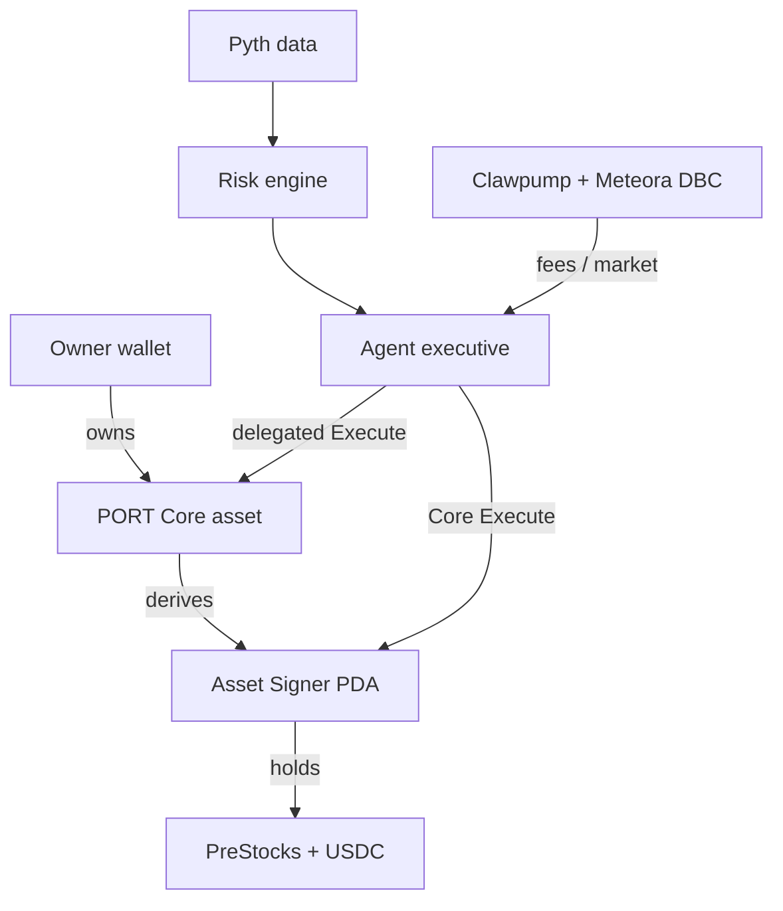

# PORT — Stocklana Hackathon Implementation Plan

> An investment account you can own.

This document is the execution brief for Claude Code Opus. Build one polished, end-to-end hackathon submission in which a Metaplex Core asset is a portable investment account. Its deterministic Asset Signer owns the portfolio, and Core Execute is the custody and transaction primitive—not a decorative integration.

## 1. Mission

Build **PORT**, an ownable autonomous fund on Solana.

A PORT is a Metaplex Core asset whose Asset Signer PDA holds USDC and tokenized stocks. The Core asset owner can trade through Core Execute, delegate execution to an autonomous operator, revoke that operator, and transfer the entire account to a new owner without moving its underlying positions.

The submission should maximize eligibility for:

1. Stocklana main track
2. PreStocks — Best Use of PreStocks
3. Clawpump — Stocknized Agent
4. Meteora — Best Use of DBC

Integrate Pyth deeply for pricing and risk controls, but do not select it as one of the three sponsor-track submissions unless track rules or priorities change.

Do **not** integrate Tessera or any non-PreStocks pre-IPO token. That may invalidate PreStocks eligibility.

## 2. Product Thesis

Traditional brokerage accounts bind custody, positions, automation, identity, and history to a provider. PORT turns those properties into an ownable Solana object.

The defining demo:

1. Wallet A owns a PORT Core asset.
2. The PORT Asset Signer holds a live portfolio.
3. Wallet A trades through Core Execute.
4. Wallet A transfers the PORT asset to Wallet B.
5. The Asset Signer address and all positions remain unchanged.
6. Wallet B can immediately control the same portfolio and execute a trade.

If this flow is not working and visually obvious, the project is not complete.

## 3. Non-Negotiable Principles

- **Core Execute is the product.** Every trade initiated by the owner or delegate must ultimately be signed by the PORT Asset Signer through Execute.
- **One excellent vertical slice.** Build one AI/private-markets portfolio, not a general brokerage platform.
- **Real onchain state over simulated UI.** Mock only an unavailable sponsor edge, never ownership, transfer, balances, Asset Signer derivation, or Execute authorization.
- **The transfer is the finale.** Spend disproportionate polish on making the before/after ownership handoff undeniable.
- **Integrations form one loop.** PreStocks supplies assets, Clawpump supplies the operator and agent launch, Meteora supplies its market, and Pyth supplies price/risk data.
- **Avoid regulated claims.** Do not describe the agent token as equity, a fund share, a security, a redemption claim, or legal ownership of the underlying portfolio.
- **Make failure safe.** Stale prices, excessive spread, missing liquidity, unauthorized callers, and failed transactions must fail closed with clear explanations.

## 4. Target User Experience

The default PORT is **AI Private Markets Fund #001** with target allocations such as:

| Asset | Target |
| --- | ---: |
| OpenAI PreStock | 30% |
| Anthropic PreStock | 25% |
| xAI PreStock | 20% |
| Databricks PreStock | 15% |
| USDC | 10% |

Use only assets that are actually available and permitted by the live PreStocks integration. Replace the example names without changing the core product if availability differs.

The primary dashboard should show:

- PORT name and Core asset address
- Current owner
- Deterministic Asset Signer address
- NAV and performance
- Positions, current weights, and target weights
- USDC cash balance
- Agent status and execution delegate
- Pyth price freshness, spread, and volatility checks
- Recent activity with transaction links
- `Rebalance`, `Delegate/Revoke`, and `Transfer PORT` actions

## 5. System Architecture



### 5.1 Core asset and Asset Signer

Each PORT is one Metaplex Core asset. Derive its Asset Signer PDA using the official Metaplex SDK/program rules. The Asset Signer owns:

- Associated token accounts for USDC and supported PreStocks
- Any protocol accounts required for trading
- SOL sufficient for rent and transaction requirements, if necessary

The human wallet owns the Core asset but should not directly custody the PORT positions.

### 5.2 Execution paths

Support two paths:

**Owner execution**

`Owner → Core Execute → Asset Signer → downstream trade/transfer instruction`

**Delegated execution**

`Authorized executive → agent delegation → Core Execute → Asset Signer → downstream instruction`

The exact instruction construction must follow current official SDKs and deployed programs. Inspect installed dependency versions and official examples before coding. Do not invent instruction names, account layouts, or delegation semantics.

### 5.3 Pricing and risk engine

Pyth data must determine whether an action is executable, not merely decorate the UI.

Minimum policy:

- Reject if the price update is stale beyond a configurable threshold.
- Reject if tokenized-stock price deviates from the reference equity price beyond the configured spread.
- Reduce or reject trade size above a volatility threshold.
- Apply an explicit market-open versus market-closed spread policy where reliable market context exists.
- Enforce maximum trade size as a percentage of NAV.
- Enforce minimum post-trade cash allocation.
- Enforce per-position maximum weight.

Every decision must produce a structured explanation that can be displayed in the activity feed.

### 5.4 Agent

The agent is a bounded portfolio operator, not an unconstrained chatbot.

Its responsibilities:

- Read positions and target weights.
- Read validated pricing/risk inputs.
- Calculate drift.
- Propose the smallest rebalance that returns the fund within tolerance.
- Produce a deterministic, human-readable rationale.
- Execute only when every policy check passes and delegated authority exists.
- Record the proposal and result.

The LLM, if used, may explain a deterministic plan but must not have unchecked control over arbitrary accounts, programs, mints, slippage, or trade size.

### 5.5 Clawpump and Meteora

Launch an agent token through the supported Clawpump path, paired with an eligible stock quote asset where track rules and live infrastructure permit it. Use a Meteora DBC configuration designed for an equity-like asset:

- Stock quote asset
- Low-slippage curve near the chosen initial reference
- Explicit fee schedule
- Explicit graduation threshold
- DAMM v2 destination if supported by the current APIs and bounty rules

The agent token is the market for the autonomous operator/community—not a claim on the PORT portfolio. Show this disclaimer in the UI and README.

Where supported, route stock-denominated creator fees to the agent's operating treasury. Never imply that token holders are entitled to those fees unless the mechanism explicitly and legally provides that right.

## 6. Repository Discovery — Do This First

Before changing code:

1. Read `README`, package manifests, workspace configuration, environment examples, and any local agent instructions.
2. Map existing applications, packages, programs, tests, and scripts.
3. Inspect the git status and preserve unrelated user changes.
4. Identify exact versions of Metaplex Core, MPL Agent, Umi/web3, wallet, Pyth, PreStocks, Clawpump, and Meteora dependencies.
5. Search the repository for existing Core Execute, Asset Signer, delegation, swap, price, and token-account code.
6. Run the existing typecheck/tests before implementation and record pre-existing failures.
7. Create a short implementation checklist in the working notes and update it as tasks finish.

If the repository is empty, initialize the smallest sensible TypeScript monorepo or single Next.js application. Prefer the project's existing conventions when present.

## 7. Suggested Technical Shape

Adapt this to the existing repository rather than forcing a rewrite.

```text
apps/
  web/                  Next.js dashboard and demo flow
packages/
  port-sdk/             PDA derivation, reads, transaction builders
  risk-engine/          Pure policy and rebalance calculations
  integrations/         PreStocks, Pyth, Clawpump, Meteora adapters
  shared/               Types, schemas, constants
scripts/
  bootstrap-demo.ts     Create/fund/configure the demo PORT
  verify-demo.ts        Assert ownership, signer, balances, delegate
```

Keep protocol-specific logic behind narrow interfaces:

```ts
interface PriceAdapter {
  getSnapshot(mint: PublicKey): Promise<PriceSnapshot>;
}

interface TradeAdapter {
  quote(input: TradeRequest): Promise<TradeQuote>;
  buildInstructions(quote: TradeQuote): Promise<TransactionInstruction[]>;
}

interface AgentLaunchAdapter {
  launch(config: AgentLaunchConfig): Promise<AgentLaunchResult>;
}
```

Use runtime-validated schemas for all offchain API responses and persisted strategy configuration.

## 8. Data Model

Define stable types before building UI components.

```ts
type PortStrategy = {
  version: 1;
  name: string;
  benchmark?: string;
  targets: Array<{ mint: string; symbol: string; weightBps: number }>;
  cashMint: string;
  minCashWeightBps: number;
  rebalanceToleranceBps: number;
  maxPositionWeightBps: number;
  maxTradeNavBps: number;
  maxPriceAgeSeconds: number;
  maxSpreadBps: number;
  highVolatilityThresholdBps?: number;
};

type RiskDecision = {
  allowed: boolean;
  checks: Array<{
    code: string;
    passed: boolean;
    observed?: string | number;
    limit?: string | number;
    message: string;
  }>;
};

type PortActivity = {
  id: string;
  portAsset: string;
  actor: string;
  authority: "owner" | "delegate";
  action: "create" | "deposit" | "trade" | "delegate" | "revoke" | "transfer";
  rationale?: string;
  riskDecision?: RiskDecision;
  signature?: string;
  status: "proposed" | "submitted" | "confirmed" | "failed";
  timestamp: string;
};
```

Weights must total 10,000 basis points. Prefer integer arithmetic and explicit token decimals. Never use floating-point math for transaction amounts.

## 9. Implementation Phases

### Phase 0 — Spike and prove the primitive

Goal: eliminate the highest technical risk before building the app.

- Create a Core asset on the target cluster.
- Derive and display its Asset Signer.
- Fund the signer with SOL and a test SPL token.
- Use owner-authorized Core Execute to transfer that token.
- Transfer the Core asset to a second wallet.
- Prove the Asset Signer is unchanged.
- Prove the previous owner can no longer perform owner-authorized execution.
- Prove the new owner can execute.
- Test and document whether an existing execution delegate persists across transfer; expose a prominent post-transfer revoke/review action if it does.

**Exit criterion:** an automated script or integration test proves this sequence with transaction signatures.

### Phase 1 — PORT SDK and lifecycle

- Implement `createPort`.
- Implement deterministic Asset Signer derivation.
- Implement portfolio balance reads.
- Implement deposit helpers.
- Implement owner execution transaction builders.
- Implement transfer transaction builder.
- Implement delegate grant and revoke flows using the actual current agent APIs.
- Add cluster-aware explorer links and typed errors.

**Exit criterion:** lifecycle works without the main dashboard.

### Phase 2 — Risk engine and rebalance planner

- Implement pure portfolio valuation.
- Implement target drift calculation.
- Implement bounded rebalance planning.
- Implement every Pyth policy check.
- Return stable structured rationales.
- Add table-driven unit tests for decimal handling, stale prices, spread breaches, volatility, cash floor, max weight, and max trade size.

**Exit criterion:** identical inputs always yield identical plans and decisions.

### Phase 3 — PreStocks trading vertical slice

- Confirm supported mints, liquidity path, cluster, decimals, and API requirements.
- Implement one buy and one sell route through the Trade Adapter.
- Wrap returned downstream instructions inside Core Execute.
- Validate mint allowlists and slippage limits before signing.
- Add graceful unavailable/illiquid states.

**Exit criterion:** the Asset Signer can acquire and sell at least one eligible PreStock end to end.

### Phase 4 — Autonomous delegated execution

- Register/configure the executive.
- Grant narrowly scoped execution authority using the actual supported mechanism.
- Run monitoring/proposal logic.
- Execute a rebalance only after deterministic policy approval.
- Implement immediate revoke.
- Store activity records with proposed action, checks, signer, signature, and result.

**Exit criterion:** the delegated executive completes a bounded trade and loses access after revocation.

### Phase 5 — Dashboard and transfer experience

Build the polished UI around the proven flows.

Routes or views:

- Landing/create PORT
- PORT dashboard
- Rebalance review
- Agent/delegation settings
- Transfer confirmation
- Transfer success/new-owner verification
- Activity detail

The dashboard must distinguish:

- Connected wallet
- Core asset owner
- Asset Signer authority
- Agent executive
- Token accounts owned by the Asset Signer

The transfer success view should show a before/after comparison with the same Asset Signer, positions, balances, and history, plus the changed Core owner.

**Exit criterion:** a judge unfamiliar with Core can explain the ownership model after watching the flow once.

### Phase 6 — Clawpump/Meteora track integration

- Verify current bounty rules and supported launch flow before implementation.
- Configure the agent launch and stock-paired DBC.
- Document why each curve, fee, quote asset, and graduation value was selected.
- Display pool/curve state and link to onchain transactions.
- Route supported fees to the agent operating treasury.
- Keep this integration out of the critical PORT ownership path so a sponsor outage cannot break the main demo.

**Exit criterion:** working live integration where possible; otherwise a clearly labeled adapter-level sandbox only if the sponsor environment itself prevents deployment.

### Phase 7 — Demo reliability and submission

- Add a one-command demo bootstrap.
- Add a read-only verification script.
- Seed the exact demo portfolio.
- Add deterministic fallback display data only for presentation continuity; never present it as live.
- Write the final README, architecture notes, setup instructions, track mapping, limitations, and disclaimer.
- Record a concise demo video with transaction explorer evidence.
- Test from a clean checkout and fresh browser profile.

## 10. Acceptance Tests

### Core ownership

- [ ] A PORT Core asset is created successfully.
- [ ] Its Asset Signer is derived deterministically and matches on every client.
- [ ] Portfolio token accounts are owned by the Asset Signer, not the user wallet.
- [ ] Owner-authorized Execute can invoke an allowlisted downstream instruction.
- [ ] Unauthorized wallets cannot execute.
- [ ] After transfer, the Asset Signer and portfolio balances are unchanged.
- [ ] After transfer, the new owner can execute and the old owner cannot.
- [ ] Delegate behavior across transfer is tested, surfaced, and documented.

### Trading and risk

- [ ] At least one eligible PreStock buy and sell completes through Core Execute.
- [ ] Stale Pyth data blocks execution.
- [ ] Excessive reference/tokenized spread blocks execution.
- [ ] Oversized trades are blocked.
- [ ] Cash-floor and max-weight rules are enforced.
- [ ] Slippage and mint/program allowlists are enforced client-side and wherever possible onchain.
- [ ] Decimal conversion and rounding behavior are covered by tests.

### Delegation

- [ ] A registered/authorized executive can execute a permitted rebalance.
- [ ] The user can revoke delegation.
- [ ] Revoked authority cannot execute.
- [ ] Every agent action has a structured rationale and policy result.

### UX

- [ ] Wallet, owner, Asset Signer, and delegate identities are visually distinct.
- [ ] Every confirmed action links to the correct explorer transaction.
- [ ] Loading, rejected-wallet, failed-transaction, stale-data, and no-liquidity states are handled.
- [ ] The transfer flow clearly proves portfolio continuity.
- [ ] The app is usable at laptop demo resolution and mobile width.

## 11. Security Requirements

- Maintain explicit allowlists for downstream program IDs and portfolio mints.
- Never accept arbitrary serialized instructions from an LLM or untrusted API.
- Verify every account, mint, owner, amount, slippage value, and program before constructing Execute.
- Use least-privilege delegation where supported.
- Make delegate persistence across ownership transfer visible and easy to revoke.
- Cap trade amount, frequency, and daily notional.
- Keep private keys out of the repository, browser bundle, logs, and screenshots.
- Provide `.env.example` with names only, never secrets.
- Treat offchain prices and sponsor APIs as untrusted input.
- Disable autonomous execution when required data sources disagree or fail.
- Log decisions without logging sensitive credentials.

## 12. Explicit Non-Goals

Do not build these before the complete vertical slice works:

- General-purpose brokerage terminal
- Social feed or copy trading
- Lending, leverage, or margin
- Multiple strategies or strategy marketplace
- Governance/DAO system
- Fractional ownership of PORT
- Cross-chain support
- Complex performance-fee accounting
- Mobile native app
- Bespoke onchain fund program unless unavoidable
- Unbounded natural-language trading
- Tessera integration

## 13. Demo Script — Target 3–4 Minutes

1. **Thesis (15 seconds):** “PORT is an investment account you can own. This Core asset controls a real portfolio through its Asset Signer.”
2. **Create (25 seconds):** Mint `AI Private Markets Fund #001`; reveal owner and Asset Signer.
3. **Fund and buy (40 seconds):** Deposit USDC and buy supported PreStocks through Core Execute. Prove the Asset Signer owns them.
4. **Risk-aware agent (40 seconds):** Show drift, Pyth freshness/spread/volatility checks, and the proposed rebalance rationale.
5. **Delegated Execute (30 seconds):** The authorized agent performs a bounded rebalance. Open the transaction.
6. **Agent market (20 seconds):** Show the Clawpump-launched, Meteora DBC market and explain the stock quote asset/fee path.
7. **Transfer finale (60 seconds):** Transfer PORT from Wallet A to Wallet B. Reconnect as B. Show identical Asset Signer, positions, NAV, history, and agent settings; then execute a small trade as B.
8. **Close (15 seconds):** “The stocks never moved. Ownership of the programmable account did.”

## 14. README Requirements

The final README must include:

- One-sentence pitch and short demo GIF/video
- Problem and solution
- Why this requires Solana and Core Execute
- Architecture diagram
- Exact owner/Asset Signer/delegate security model
- Sponsor integration table
- Local setup and environment variables
- Supported cluster and deployed addresses
- One-command demo bootstrap and verification
- Test commands
- Known limitations
- Regulatory/product disclaimer
- Transaction links proving the core demo

Suggested sponsor table:

| Track | Integration | Why it is essential |
| --- | --- | --- |
| Main | Portable Core-owned account | New onchain ownership primitive |
| PreStocks | Assets held and traded by Asset Signer | Investable private-market portfolio |
| Clawpump | Tokenized autonomous operator | Agent launch and operating loop |
| Meteora | Stock-quoted DBC | Market and stock-denominated fee path |
| Pyth | Execution risk gate | Prices directly permit or block trades |

## 15. Definition of Done

The project is done when a clean checkout can reproduce a live sequence in which:

1. A Core PORT is created.
2. Its Asset Signer receives USDC.
3. It obtains at least one eligible tokenized stock through Core Execute.
4. Pyth-backed rules approve or reject a proposed rebalance.
5. An authorized delegate executes a bounded action and can be revoked.
6. The Core asset transfers to a second wallet.
7. The second wallet controls the unchanged Asset Signer portfolio.
8. The submission documents and demonstrates the Clawpump/Meteora integration.
9. Tests, typecheck, lint, and production build pass, excluding clearly documented pre-existing failures.

## 16. Instructions to Claude Code Opus

- Work autonomously through the phases in order, but stop and report a blocker when credentials, tokens, deployed sponsor infrastructure, or an irreversible external action requires the user.
- Do not invent SDK calls or sponsor endpoints. Inspect installed types and current official documentation/examples when needed.
- Prefer small commits or clearly separated change sets if git commits are authorized; otherwise keep a precise change log.
- Run the narrowest relevant tests after each change and the full suite before handoff.
- Preserve unrelated files and user changes.
- When an integration cannot run locally, implement and test its adapter boundary, document the exact missing prerequisite, and continue with the rest of the product.
- Optimize for the live judging demo, security, and conceptual clarity—not feature count.
- Never claim a mocked or devnet-only interaction is mainnet/live.

## 17. Priority Order Under Time Pressure

If time becomes constrained, cut in this order from first cut to last:

1. Rich agent chat
2. Historical performance charts
3. Fee-routing visualization
4. Automated monitoring loop; retain manual “Run agent” execution
5. Additional PreStocks
6. Full Clawpump/Meteora UI; retain a working launch and transaction evidence

Never cut:

- Asset Signer custody
- Core Execute trading
- Owner-to-owner PORT transfer
- New-owner execution
- Pyth-backed safety decision
- Clear demo evidence

